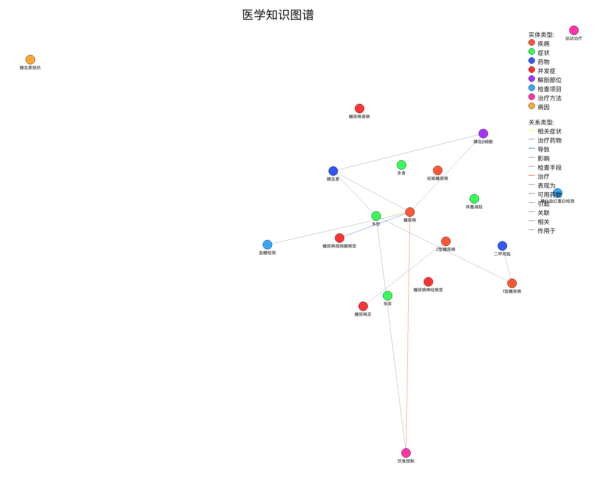
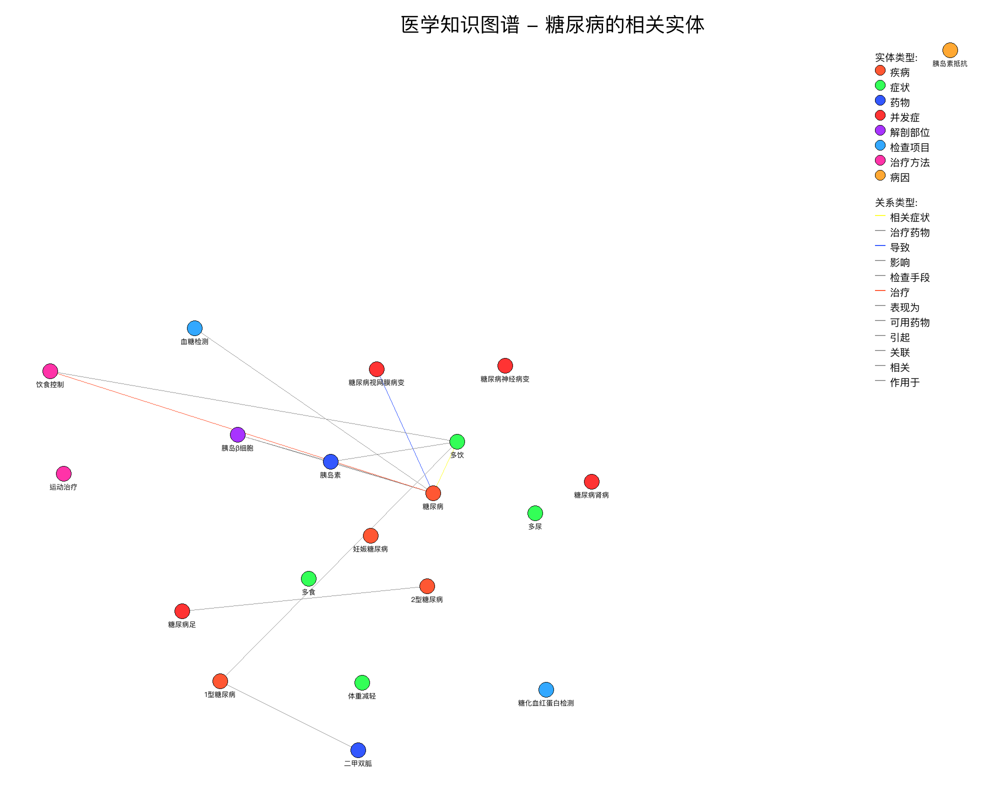

# 医学领域知识图谱问答系统

基于DeepSeek API构建的医学领域知识图谱问答系统，用于实现医学知识的智能检索与问答。

## 功能特点

- 医学实体与关系抽取
- 知识图谱构建与存储
- 基于DeepSeek API的自然语言理解与生成
- 医学知识问答
- 知识图谱可视化（多种方式）

## 项目结构

```
medical_kg/
├── src/
│   ├── data/            # 数据处理相关代码
│   ├── models/          # 模型定义代码
│   ├── utils/           # 工具函数
│   │   ├── api_client.py # DeepSeek API客户端
│   │   └── ...
│   ├── visualization/   # 可视化相关代码
│   │   └── kg_visualizer.py # 知识图谱可视化器
│   └── api/             # API接口
├── tests/               # 测试代码
├── data/                # 数据集
│   ├── raw/             # 原始数据
│   ├── processed/       # 处理后的数据
│   └── visualization/   # 可视化结果存储
└── notebooks/           # Jupyter notebooks用于探索性分析
```

## 使用DeepSeek API

本项目使用DeepSeek API进行医学实体抽取、关系识别和问答功能，无需下载大型模型文件。使用前需要获取DeepSeek API密钥。

### 获取API密钥

1. 前往[DeepSeek平台](https://platform.deepseek.com/api_keys)注册并申请API密钥
2. 在运行项目时提供API密钥（通过环境变量或命令行参数）

### 设置API密钥

可以通过以下两种方式设置API密钥：

1. 环境变量方式：
```bash
export DEEPSEEK_API_KEY="your-api-key"
```

2. 命令行参数方式：
```bash
python src/main.py build_kg --api-key "your-api-key"
```

## 安装与使用

1. 安装依赖:
```bash
pip install -r requirements.txt
```

2. 运行知识图谱构建:
```bash
python src/main.py build_kg --api-key "your-api-key" --model-name "deepseek-chat"
```

3. 启动问答系统:
```bash
python src/main.py serve --api-key "your-api-key" --model-name "deepseek-chat"
```

4. 在浏览器中访问 `http://localhost:5000` 使用Web界面

### 知识图谱可视化

本系统提供多种知识图谱可视化方式：

1. 使用Matplotlib生成静态图像：
```bash
python src/main.py visualize --type matplotlib
```

2. 使用PyVis生成交互式HTML可视化：
```bash
python src/main.py visualize --type pyvis
```

3. 使用Plotly生成交互式HTML可视化：
```bash
python src/main.py visualize --type plotly
```

4. 使用PIL直接生成图像（解决中文字体问题）：
```bash
python src/main.py visualize --pil-only
```

5. 生成特定实体的子图可视化：
```bash
python src/main.py visualize --entity 糖尿病 --max-nodes 50 --depth 2
```

6. 生成图谱统计信息：
```bash
python src/main.py visualize --stats
```

7. 导出为D3.js可用的JSON格式：
```bash
python src/main.py visualize --export-d3
```

所有可视化结果将保存在`data/visualization`目录中。

## 可用的DeepSeek模型

本系统支持多种DeepSeek模型：

- `deepseek-chat`：默认模型，DeepSeek-V3系列，适合一般问答
- `deepseek-reasoner`：推理能力增强的DeepSeek-R1模型
- `deepseek-coder`：编程相关任务专用模型

可以通过`--model-name`参数指定要使用的模型。

## API接口说明

系统提供以下API接口：

- `GET /` - Web界面
- `GET /api/health` - 系统健康检查
- `POST /api/query` - 提交问题并获取答案
- `GET /api/entities` - 获取知识图谱中的实体
- `GET /api/entity/<entity_id>` - 获取特定实体的详细信息

## 数据来源

- 医学文献
- 医学词典
- 临床指南
- 医学百科

## 优势

- 无需下载大型模型，节省本地资源
- 使用DeepSeek最新模型能力
- 低硬件要求，可在普通电脑上运行
- 构建结构化的医学知识图谱，增强问答质量
- 提供友好的用户界面和API接口
- 多种可视化方式，支持中文显示

## 可视化效果示例

### 静态图像（PIL生成）


### 交互式可视化（PyVis）


### 实体子图（以"糖尿病"为中心）


## 许可证

MIT 